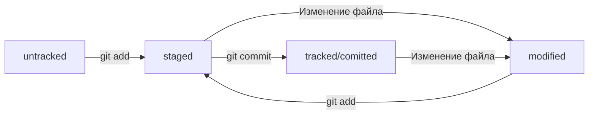

## Мое первое README для курсса по GIT

*Умение работать с **Git*** - важный навыr для разработчика.

**GitHub** дает возможность совместной разработки кода.

Ссылка на случайный сайт: [custom-shop](https://custom-shop.ru/ "Перейти в custom-shop.ru") 

**Git Bash** - консольный инструмент для Windows. [Скачать.](https://git-scm.com/download/win)

**pwd** от англ. print working directory — «показать рабочую папку».

**cd** от англ. change directory — «сменить директорию».

**~** обозначение домашней директории.

**ls** от англ. list directory contents — "отобразить содержимое". **ls -a** отобразить вместе со скрытыми файлами.

Чтобы вернуться в родительскую директорию — то есть на уровень выше, — вместо названия папки нужно написать две точки: **".."**.

**touch** (англ. «коснуться») с именем файла в качестве параметра: touch %ИМЯ_ФАЙЛА%.

Для создания директорий через терминал используют другую команду — **mkdir** (от англ. make directory — «создать директорию»). 
Можно создать целую структуру директорий одной командой с помощью флага **-p**. **$ mkdir -p dir1/dir-inside/dir-deeper-inside**
- создали папку dir-deeper-inside в папке dir-inside, которая находится в папке dir1.

**mv** от англ. move — «переместить» для перемещения файлов между дирикториями.

**cp** (от англ. copy — «копировать»). В простом виде cp принимает два параметра: что копируем и куда копируем.
$ cp что_копируем куда_копируем. ($ cp index.html style.css script.js src/
- скопировали три файла (index.html, style.css и script.js) в папку src)

**cat** (от англ. concatenate and print — «объединить и распечатать») вместе с именем файла. Команда распечатает то, что содержится в нём.
$ cat myfile.txt - распечатали содержимое файла myfile.txt.

## Хеш — идентификатор коммита

Git хеширует (преобразует) информацию о коммите(набор данных: когда был сделан коммит, содержимое файлов в репозитории на момент коммита
 и ссылка на предыдущий, или родительский (англ. parent), коммит.) с помощью алгоритма SHA-1 (от англ. Secure Hash Algorithm — «безопасный алгоритм хеширования»)
 и получает для каждого коммита свой уникальный хеш — результат хеширования.

**git log --oneline** - Получить сокращённый лог. Для этого команда git log --oneline автоматически подбирает такую длину сокращённых хешей,
 чтобы они были уникальными в пределах репозитория и Git всегда мог понять, о каком коммите идёт речь.

## Файл HEAD

Файл **HEAD** (англ. «голова», «головной») — один из служебных файлов папки .git. Он указывает на коммит, который сделан последним (то есть на самый новый).
Внутри HEAD — ссылка на служебный файл: refs/heads/master (или refs/heads/main в зависимости от названия ветки). Если заглянуть в этот файл, можно увидеть хеш последнего коммита.

## Статусы untracked/tracked, staged и modified

**untracked** (англ. «неотслеживаемый») - Мы говорили, что новые файлы в Git-репозитории помечаются как untracked, то есть неотслеживаемые. Git «видит», что такой файл существует,
 но не следит за изменениями в нём. У untracked-файла нет предыдущих версий, зафиксированных в коммитах или через команду git add.

**staged** (англ. «подготовленный») - После выполнения команды git add файл попадает в staging area (от англ. stage — «сцена», «этап [процесса]» и area — «область»), то есть в список файлов,
 которые войдут в коммит. В этот момент файл находится в состоянии staged. Staging area также называют index (англ. «каталог») или cache (англ. «кеш»), а состояние файла staged иногда называют
 indexed или cached.

**tracked** (англ. «отслеживаемый») - Состояние tracked — это противоположность untracked. Оно довольно широкое по смыслу: в него попадают файлы, которые уже были зафиксированы с помощью git commit,
 а также файлы, которые были добавлены в staging area командой git add. То есть все файлы, в которых Git так или иначе отслеживает изменения.

**modified** (англ. «изменённый») - Состояние modified означает, что Git сравнил содержимое файла с последней сохранённой версией и нашёл отличия. Например, файл был закоммичен и после этого изменён.

